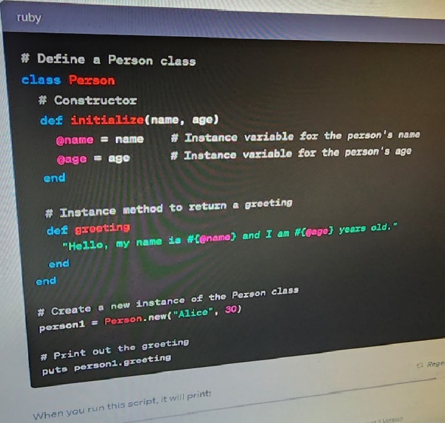

# Best Practices For Writing Documentaion Well

When you can always provide a codeblock instead of a screenshot.
If you need to take a screenshot make sure it's not a photo from your phone.

## Step 1 - Using Codeblocks

Codeblocks in markdonw make it _very easy_ for tech people to **copy, paste, share code**.
A good cloud engineer uses codebloacke whenever possible because it allows others to
copy and paste their code to replicate or research issues.


In order to create codeblocks: 
- You need to use three back ticks at the begining of the codeblock, and again at the end of the codeblock. (```)
- Not to be confused with single quotations. (')

```
from flask import Flask, request
import smtplib
from email.mime.text import MIMEText

app = Flask(__name__)

@app.route('/send_email', methods=['POST'])
def send_email():
    if request.method == 'POST':
        try:
            # Extract data from the request
            recipient_email = request.form['recipient_email']
            subject = request.form['subject']
            message = request.form['message']

            # Your email configuration
            sender_email = 'your_email@gmail.com'
            sender_password = 'your_password'

            # Create and send the email
            msg = MIMEText(message)
            msg['From'] = sender_email
            msg['To'] = recipient_email
            msg['Subject'] = subject

            server = smtplib.SMTP('smtp.gmail.com', 587)
            server.starttls()
            server.login(sender_email, sender_password)
            server.sendmail(sender_email, recipient_email, msg.as_string())
            server.quit()

            return "Email sent successfully!"
        except Exception as e:
            return f"Error sending email: {str(e)}"

if __name__ == '__main__':
    app.run(debug=True)
```

When you can, apply syntax highlighting to your codeblocks

```python
from flask import Flask, request
import smtplib
from email.mime.text import MIMEText

app = Flask(__name__)

@app.route('/send_email', methods=['POST'])
def send_email():
    if request.method == 'POST':
        try:
            # Extract data from the request
            recipient_email = request.form['recipient_email']
            subject = request.form['subject']
            message = request.form['message']

            # Your email configuration
            sender_email = 'your_email@gmail.com'
            sender_password = 'your_password'

            # Create and send the email
            msg = MIMEText(message)
            msg['From'] = sender_email
            msg['To'] = recipient_email
            msg['Subject'] = subject

            server = smtplib.SMTP('smtp.gmail.com', 587)
            server.starttls()
            server.login(sender_email, sender_password)
            server.sendmail(sender_email, recipient_email, msg.as_string())
            server.quit()

            return "Email sent successfully!"
        except Exception as e:
            return f"Error sending email: {str(e)}"

if __name__ == '__main__':
    app.run(debug=True)
```

- Take note of where the backtick button is located.
- Generally it appears above the tab key, but this varies depending your keyboard layout.
  


#### Good Cloud Engineers ues codeblocks for both code and errors that appear in the console. 


```bash
irb(main):001:0> 1 / 0
ZeroDivisionError: divided by 0
irb(main):002:0>
```
> The abbove snippet is an example codeblock error that appears in Bash.


> There are certain cases where it's okay to take photos from your phone. This something like showing a keyboard that does not appear on your computer screen.
If it's rendered on your computer screen, it should be a screenshot.

## Step 2 - How to take screenshots

**DON'T DO THIS!!**



This is what a screenshot from your computer should look like


**DO THIS INSTEAD**


To take screenshots on both Mac and Windows computers, you can use hotkey combinations. Here are the most common hotkeys for taking screenshots on each operating system:

**For Mac:**

1. **Capture the Entire Screen:**
   - Press `Shift + Command (⌘) + 3`. This will capture the entire screen and save the screenshot as a file on your desktop by default.

2. **Capture a Selected Portion of the Screen:**
   - Press `Shift + Command (⌘) + 4`. This will turn your cursor into a crosshair. Click and drag to select the portion of the screen you want to capture, and release the mouse button. The screenshot will be saved as a file on your desktop.

3. **Capture a Specific Window:**
   - Press `Shift + Command (⌘) + 4`, then press the `Spacebar`. Your cursor will turn into a camera icon. Click on the window you want to capture. The screenshot of the selected window will be saved as a file on your desktop.

**For Windows:**

1. **Capture the Entire Screen:**
   - Press `PrtScn` (Print Screen) key. The screenshot will be copied to your clipboard, and you can paste it into an image editing program (like Paint or Photoshop) to save it or make edits.

2. **Capture the Active Window:**
   - Press `Alt + PrtScn`. This captures only the active window and copies it to your clipboard.

3. **Capture a Selected Portion of the Screen (Windows 10 and later):**
   - Press `Windows + Shift + S`. This will dim the screen, and you can then click and drag to select the portion of the screen you want to capture. The screenshot will be copied to your clipboard, and you can paste it into an image editing program to save it.

4. **Capture the Entire Screen and Save as a File (Windows 10 and later):**
   - Press `Windows + Shift + S`, then select the "Screen snip" option from the small toolbar that appears at the top of your screen. This allows you to capture the entire screen and save it as a file without using the clipboard.

Please note that the exact key combinations and functionality may vary depending on your specific Windows version. Additionally, on some Windows laptops, you might need to use the "Fn" key in combination with the hotkeys mentioned above, like `Fn + PrtScn` or `Fn + Windows + Shift + S`.

## Step 3 - Use Github Flavored Markdown Tasks List
Github extends Markdown to have a list where you can check off items. [<sup>[1]</sup>](#external-references)

- [x] Finish Step 1
- [] Finish Step 2
- [x] Finish Step 3

## Step 4 - Use Emojis (Optional)

Github Flavored Markdown (GFM) supports emoji shortcodes.
Here are some examples:

|Name | Shortcode | Emoji |
| --- | --- | --- |
| Cloud | `:cloud:` | :cloud: |
| Flying Saucer | `:flying_saucer:` | :flying_saucer: |
| Alien | `:alien:` | :alien: |

## Step 5 - How to create a table 

You can use the following format to create tables: 

```md

|Name | Shortcode | Emoji |
| --- | --- | --- |
| Cloud | `:cloud:` | :cloud: |
| Flying Saucer | `:flying_saucer:` | :flying_saucer: |
| Alien | `:alien:` | :alien: |
```

Github extends the funcionalitiy of Markdown tables to provide more alignment and table cell formatting options.[<sup>[2]</sup>](#external-references)
## External References
- [GitHub Flavored Markdown Spec](https://github.github.com/gfm/) 
- [Basic Writing and Formatting Syntax (Github Flavoured Markdown)](https://docs.github.com/en/get-started/writing-on-github/getting-started-with-writing-and-formatting-on-github/basic-writing-and-formatting-syntax#quoting-text)
- [GFM - Task Lists](https://docs.github.com/en/get-started/writing-on-github/getting-started-with-writing-and-formatting-on-github/basic-writing-and-formatting-syntax#task-lists) <sup>[1]</sup>
- [GFM Emoji CheatSheet](https://github.com/ikatyang/emoji-cheat-sheet/)
- [GFM - Tables (with extensions)](https://github.github.com/gfm/#tables-extension-)<sup>[2]</sup>


